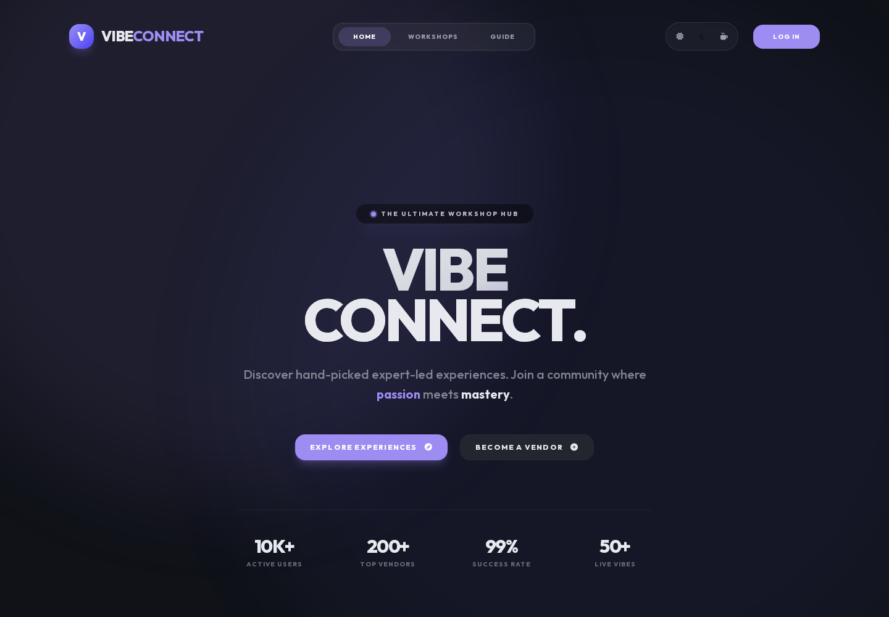
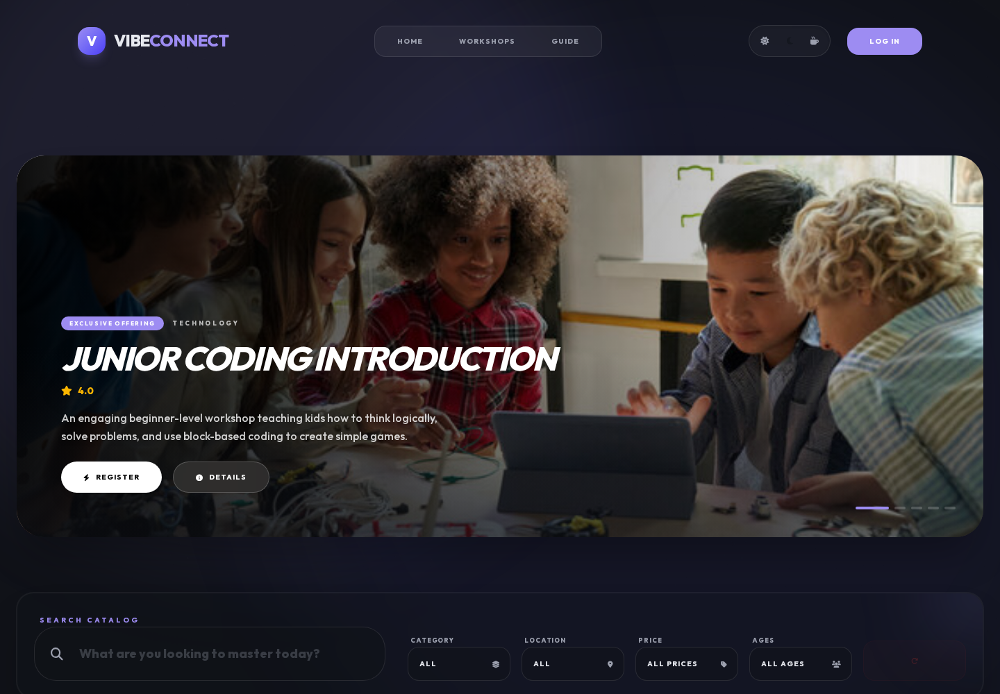
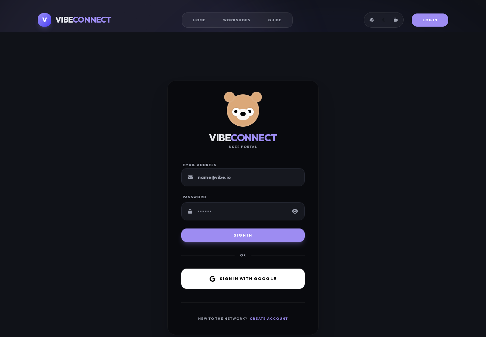
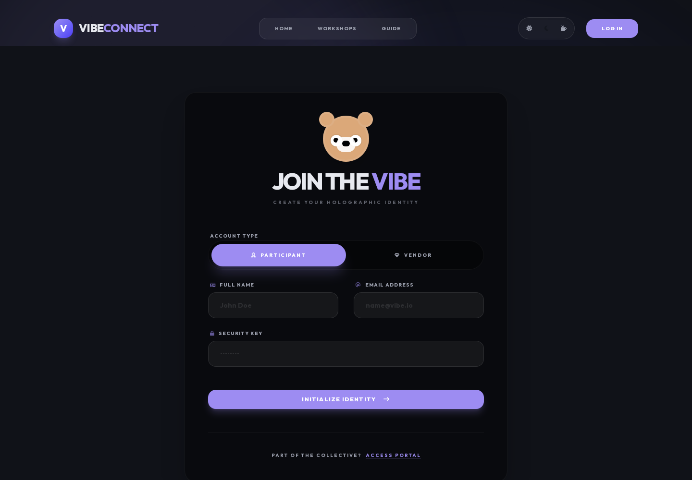

<div align="center">

# VibeConnect

### Discover workshops. Book experiences. Connect with people.

A full-stack workshop discovery and booking platform built as a two-semester Commercial Computing project.

[Live Product](https://vibe-connect-tau.vercel.app/) · [Project Documentation](./docs/PROJECT_DOCUMENTATION.md) · [Agile Sprint History](./docs/AGILE_SPRINT_HISTORY.md) · [Contributors](./docs/CONTRIBUTORS.md)


</div>

---

## What is VibeConnect?

VibeConnect is a centralized platform for discovering, booking, and managing workshops.

The project started from a real user problem identified during Semester 1: workshop discovery and registration were spread across Instagram, WhatsApp, Facebook Messenger, phone calls, Google Forms, and manual payment processes. Participants had difficulty comparing workshops, receiving fast confirmation, understanding refund rules, and trusting unfamiliar organizers. Organizers also had to manage participants, payments, and communication across several disconnected tools.

VibeConnect brings those activities into one system.

Participants can discover workshops, filter them by relevant criteria, register one or multiple people, submit consent information for under-18 participants, pay through Stripe, view booking status, request refunds, submit reviews, and report unresolved issues.

Vendors get a dedicated management area for creating workshops, managing participants, controlling refund rules, tracking revenue, handling custom requests, and managing workshop availability.

Administrators get system-wide controls for vendor verification, user management, payment oversight, refund monitoring, reports, and access control.

## Why it was built

The Semester 1 proposal was supported by a structured participant survey. The documented findings included:

- 100% of respondents reported slow replies from organizers.
- 67% found the registration process burdensome because of multiple steps and a lack of instant confirmation.
- 78% reported unclear refund or cancellation rules.
- Instagram, WhatsApp, and phone calls were among the main communication methods with organizers.

The target market was divided into three main participant groups:

- Children aged 3-15, usually represented by a parent or guardian.
- Young adults aged 16-25.
- Adults aged 25+.

The proposed business model used a 2% commission on paid bookings, supported by sponsored event placements and local business partnerships.

## From proposal to final product

The architecture changed during development.

The Semester 1 proposal described a static frontend with an API layer and PostgreSQL database. During Semester 2, the implementation evolved into a modern Next.js application using Firebase and Stripe.

### Final stack

| Layer | Technology |
|---|---|
| Frontend | Next.js App Router, React, TypeScript |
| UI | Tailwind CSS 4 |
| Authentication | Firebase Authentication |
| Database | Firebase Firestore |
| File storage | Firebase Storage |
| Payments | Stripe |
| Charts | Recharts |
| PDF generation | jsPDF |
| Animation | Framer Motion, Lenis |
| Testing | Playwright |
| Hosting | Vercel |

## Product features

### Participant experience

- Workshop catalogue with search and filters.
- Workshop details, availability, location, price, age group, and refund information.
- Multi-participant registration.
- Single checkout flow.
- Stripe payment integration.
- Booking and payment status.
- Consent upload for workshops requiring it.
- Refund requests and status tracking.
- Reviews controlled by registration and workshop completion rules.
- Workshop issue reporting.

### Vendor experience

- Vendor onboarding and verification.
- Workshop creation, editing, and deletion.
- Participant management.
- Refund policy configuration.
- Refund request handling.
- Revenue reporting.
- Custom workshop requests.
- Workshop freeze controls.
- Participant and consent visibility.

### Admin experience

- Vendor approval and rejection.
- User suspension and deletion.
- Payment review.
- Refund oversight.
- Reports and issue monitoring.
- Role-based access control.

## Agile development

The system was delivered through three development sprints.

| Sprint | Focus | Main outcome |
|---|---|---|
| Sprint 1 | Workshop discovery, booking, vendor management | Core workshop ecosystem and booking flow |
| Sprint 2 | Payments, admin control, refunds, bulk booking, consent | Commercial reliability and financial controls |
| Sprint 3 | Authentication, Stripe, refunds, reporting, security | Secure and commercially mature final system |

Sprint 4 documentation and presentation material consolidated the completed implementation and evidence.

The project also used lecturer feedback as backlog refinement input. Later changes addressed refund ownership, refund timing, workshop freezing after registrations, review validity, Stripe refund handling, reporting, and role restrictions.

## Contributors

### Group 11

| Contributor | Student ID | Sprint 1 | Sprint 2 | Sprint 3 |
|---|---|---|---|---|
| Sanuthi Vinsith Mayadunna | CB012708 | Scrum Master / BA | Developer | QA |
| Faraj Farook | CB012653 | Developer | QA | Developer |
| Tony Willis David | CB015830 | QA | Scrum Master / BA | BA / Scrum Master |

The role rotation was part of the Agile assessment structure and gave each team member experience across analysis, coordination, development, and quality assurance.

See [full contributor notes](./docs/CONTRIBUTORS.md).

## Testing and security

The project includes Playwright end-to-end testing for critical paths, integration behaviour, admin flows, security access controls, and UI checks.

User acceptance testing was performed using Participant, Vendor, and Admin roles against the hosted application.

Security validation included:

- Browser-based security and regression checks.
- Firebase Console verification.
- Stripe Test Mode.
- Nikto.
- Nuclei.

The documented Nuclei scan reported no medium, high, or critical findings. Nikto identified two low-risk hardening items: a permissive CORS policy and a missing X-Content-Type-Options header.

See [Testing and Security Evidence](./docs/TESTING_AND_SECURITY.md).

## Product showcase

The repository includes an automated Playwright workflow that opens the hosted product and captures the real rendered interface into `docs/screenshots/`.

<table>
  <tr>
    <td width="50%">
      <p align="center"><strong>Homepage</strong></p>
      
    </td>
    <td width="50%">
      <p align="center"><strong>Workshop discovery</strong></p>
      
    </td>
  </tr>
  <tr>
    <td width="50%">
      <p align="center"><strong>Login</strong></p>
      
    </td>
    <td width="50%">
      <p align="center"><strong>Registration</strong></p>
      
    </td>
  </tr>
</table>


The screenshots are generated from the hosted product and refreshed automatically through GitHub Actions.

[View the screenshot workflow](./.github/workflows/capture-readme-screenshots.yml).

## Documentation

- [Project Documentation](./docs/PROJECT_DOCUMENTATION.md)
- [Academic Source Material](./docs/ACADEMIC_SOURCE_INDEX.md)
- [Agile Sprint History](./docs/AGILE_SPRINT_HISTORY.md)
- [Testing and Security Evidence](./docs/TESTING_AND_SECURITY.md)
- [Contributors](./docs/CONTRIBUTORS.md)
- [Screenshot capture workflow](./.github/workflows/capture-readme-screenshots.yml)
- [Screenshot capture script](./scripts/capture-readme-screenshots.mjs)

## Run locally

### Requirements

- Node.js
- pnpm
- A Firebase project
- Stripe test configuration

### Install

```bash
pnpm install
```

Create `.env.local` in the project root:

```env
NEXT_PUBLIC_FIREBASE_API_KEY=
NEXT_PUBLIC_FIREBASE_AUTH_DOMAIN=
NEXT_PUBLIC_FIREBASE_PROJECT_ID=
NEXT_PUBLIC_FIREBASE_STORAGE_BUCKET=
NEXT_PUBLIC_FIREBASE_MESSAGING_ID=
NEXT_PUBLIC_FIREBASE_APP_ID=
STRIPE_TEST_CLIENT_SECRET=
```

Start the development server:

```bash
pnpm dev
```

Open `http://localhost:3000`.

### Useful commands

```bash
pnpm build
pnpm lint
pnpm test:e2e
```

## Repository structure

```text
app/                         Next.js routes, views, controllers and components
firebase/                    Firebase configuration and Firestore actions
lib/                         Shared utilities and Stripe integration
tests/                       Playwright end-to-end tests
docs/                        Project, sprint, testing and screenshot documentation
scripts/                     Automated README screenshot capture
```

## Live system

**Vercel:** https://vibe-connect-tau.vercel.app/

The hosted deployment was the system used for the documented user acceptance and security testing.

## Academic context

VibeConnect was developed for COMP50001 Commercial Computing at Level 5.

The project covered:

- Domain research and requirements gathering.
- Stakeholder and persona analysis.
- Agile planning and sprint delivery.
- Software implementation.
- Project management.
- Testing and quality assurance.
- Security validation.
- User acceptance testing.
- Final product demonstration.

---

<div align="center">

Built by Group 11

</div>